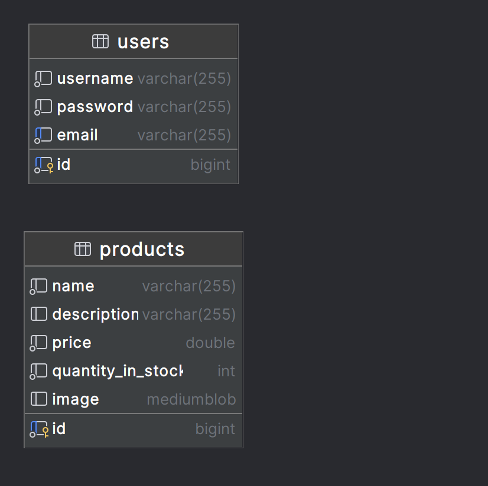

# Vendinha da Vó Cecília

Este é um projeto desenvolvido como parte de um teste para a vaga de Desenvolvedor Web na Empresa Sertão. O objetivo é criar um sistema simples para controle de estoque da "Vendinha da Vó Cecília", onde é possível realizar o cadastro, listagem, edição e exclusão de produtos, além de permitir login de usuários.

## Tecnologias Utilizadas

### Backend
- **Java com Spring Boot**
- **MySQL**
- **JWT** (JSON Web Tokens) para controle de login
- **Spring Data JPA** para persistência de dados
- **Swagger (Springdoc OpenAPI)** para documentação da API

### Frontend
- **React.js**
- **Axios** para consumo dos endpoints do backend
- **React Router** para gerenciamento das rotas
- **Bootstrap** para estilização
- **React-Bootstrap** para componentes de interface

### Containerização
- **Docker** (usando Docker Compose) para execução dos serviços de backend, frontend e banco de dados

## Como Executar o Projeto

Para rodar o projeto e configurar o ambiente corretamente, consulte o manual de execução completo disponível em:

```
/doc/TUTORIAL.pdf
```

### Pré-requisitos
- **Docker** instalado para rodar os containers.
- **Node.js** para o frontend, se necessário rodar fora do container.
- **Java 20+** e **Maven** para o backend, se necessário rodar fora do container.

## Estrutura do Projeto

```plaintext
vendinha-vo-cecilia/
├── backend/            # Código do backend em Java (Spring Boot)
├── frontend/           # Código do frontend em React
├── db/                 # Dump do banco de dados e modelo do banco
│   └── modelo.png      # Modelo visual do banco de dados
│   └── schema.sql      # DDL do banco de dados
├── doc/                # Tutoriais e manuais de execução
│   └── TUTORIAL.pdf    # Guia completo de como executar o projeto
└── README.md           # Documentação do projeto
└── docker-compose.yml  # Instruções para containers Docker
```

## Modelo do Banco de Dados

O modelo utilizado para persistência dos dados no banco MySQL está ilustrado na imagem a seguir:



### Entidades Principais

1. **User**: Representa os usuários do sistema que podem fazer login e gerenciar os produtos.
2. **Product**: Representa os produtos da vendinha, contendo atributos como nome, descrição, preço e quantidade em estoque.
3. **Category** (opcional): Organiza os produtos em diferentes categorias.
4. **StockMovement** (opcional): Controla as movimentações de estoque, como entrada e saída de produtos.

## Documentação dos Endpoints (Swagger)

A documentação dos endpoints da API pode ser acessada após iniciar o backend na seguinte URL:

```
http://localhost:8181/swagger-ui/index.html
```

## Considerações Finais

Este projeto foi desenvolvido com foco na organização do código, eficiência e usabilidade. Caso tenha dificuldades na execução ou surjam dúvidas, sinta-se à vontade para entrar em contato.

---

Essa versão do README indica o manual de execução e inclui as informações adicionais sobre as tecnologias usadas no frontend, além de apontar para o modelo do banco de dados como uma imagem.